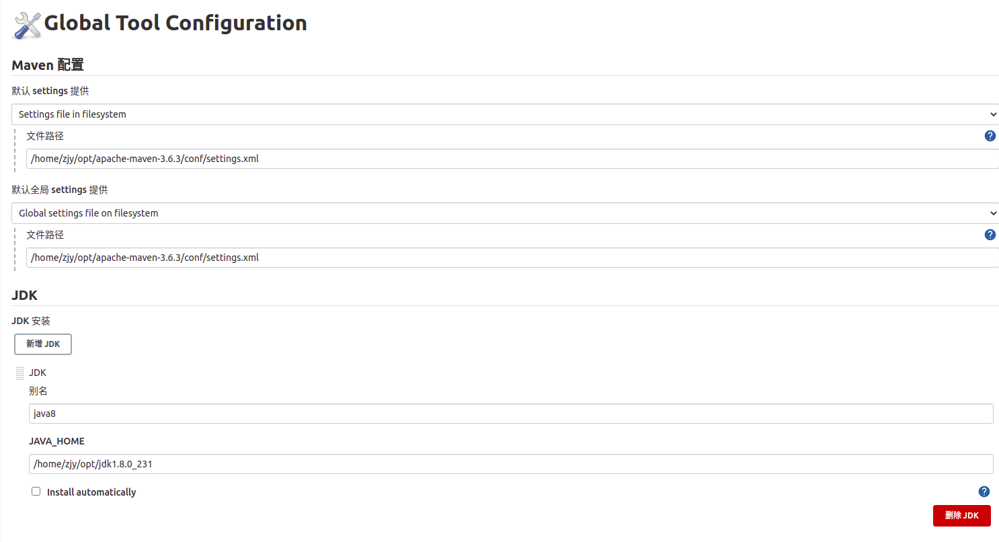
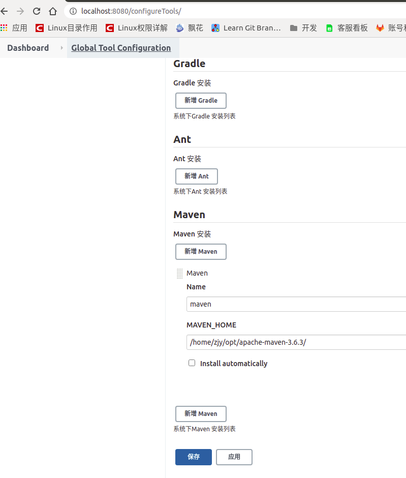
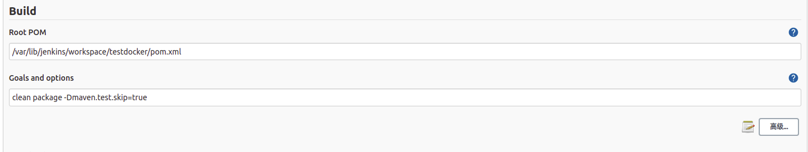
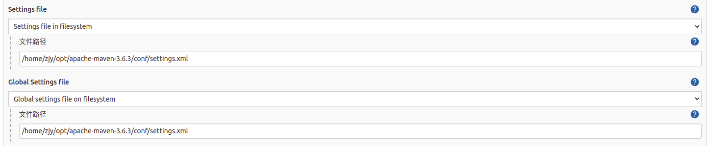
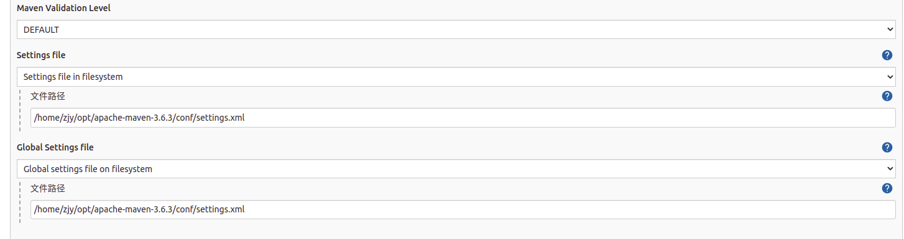
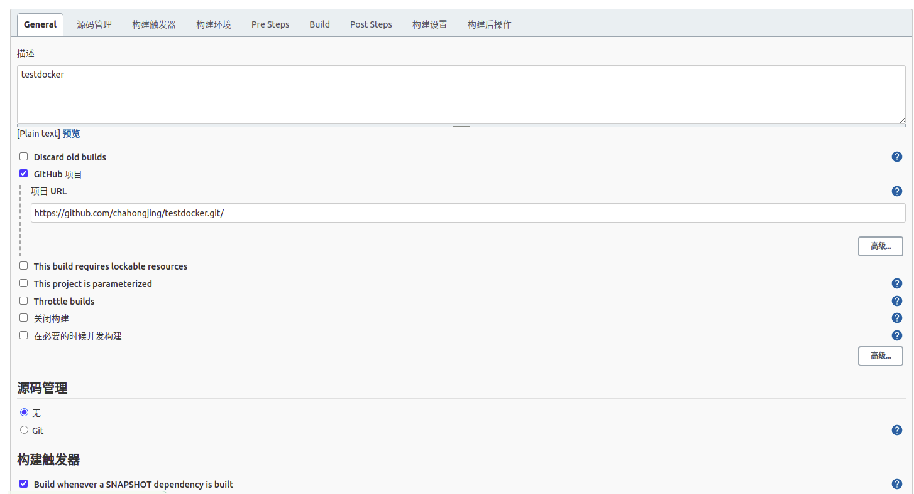
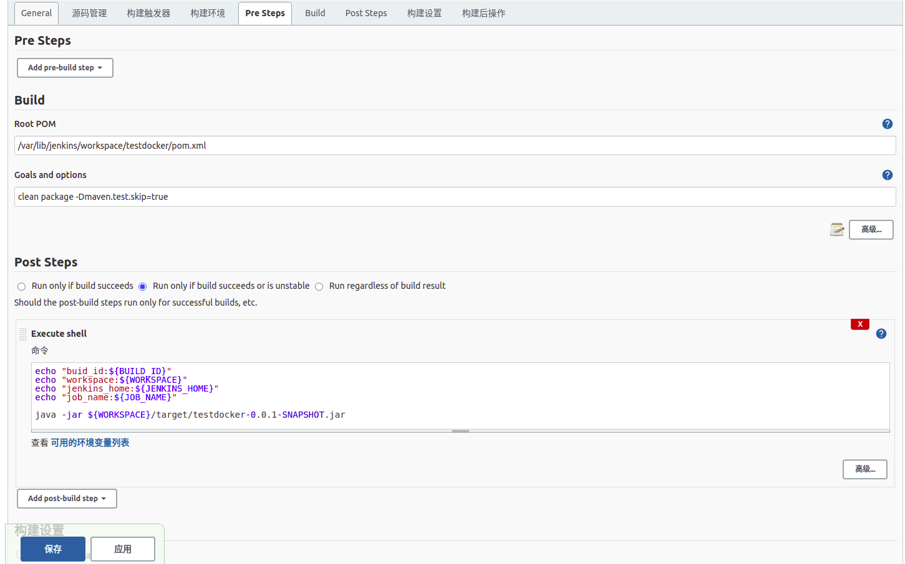
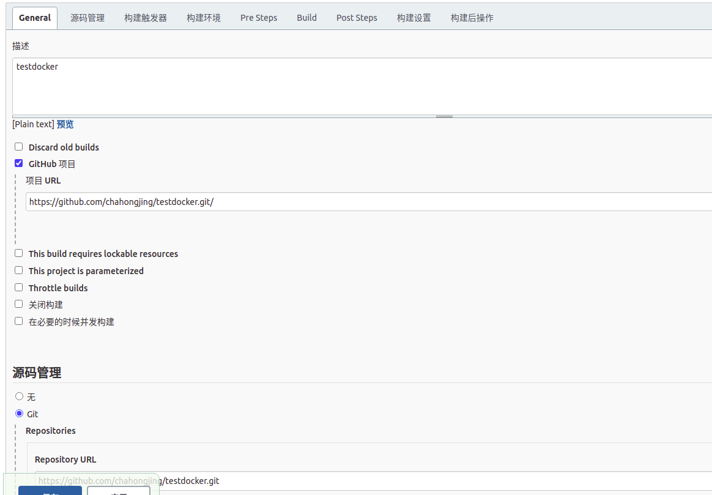

### 安装jenkins
``` shell
# 我们将存储库密钥添加到系统，添加密钥后，系统将返回OK
wget -q -O - https://pkg.jenkins.io/debian/jenkins-ci.org.key | sudo apt-key add -
# 将Debian包存储库地址附加到服务器的sources.list
echo deb http://pkg.jenkins.io/debian-stable binary/ | sudo tee /etc/apt/sources.list.d/jenkins.list
# 更新软件库
sudo apt-get update
# 安装jenkins，如果提示--allow-unauthenticated，则把此项添加到-y 后面，注意要添加空格，如果报错，看是不是java没有配置软链接到/usr/bin中
sudo apt-get install -y jenkins
# 报错，其中/opt/jdk1.8.0_231/bin/java是我本地java执行文件目录，或者检查8080端口是否被占用
sudo ln -s /opt/jdk1.8.0_231/bin/java /usr/bin/java
```

### 启动jenkins
```shell script
# 启动服务
service jenkins start
# 停止
service jenkins stop
# 重启
service jenkins restart
# 配置jenkins
cat /var/lib/jenkins/secrets/initialAdminPassword
```

### maven插件设置
```shell script
manage jenkins-->manage plugins-->可选插件-->Maven Integration
# 调整maven，在具体构建项目实例里配置
build-->高级，填写settings.xml路径


如果不是在jenkins的工作目录，则需要把构建相关的目录权限授权jenkins，不然构建会报错
jenkins添加到root
gpasswd -a jenkins root
修改配置文件sudo vim /etc/default/jenkins， 或/etc/sysconfig/jenkins
NAME=root

修改仓库目录权限组为jenkins，不然下包时会报错
sudo chown -R jenkins:jenkins /opt/apache-maven-3.6.3/repository

```

```shell script
#!/bin/bash 

#export BUILD_ID=dontKillMe这一句很重要，这样指定了，项目启动之后才不会被Jenkins杀掉。
export BUILD_ID=dontKillMe

#指定最后编译好的jar存放的位置
www_path=/var/codespace/test/

#Jenkins中编译好的jar位置
jar_path=/var/lib/jenkins/jobs/shaw/workspace/shaw-web/target/

#Jenkins中编译好的jar名称
jar_name=shaw.jar

#获取运行编译好的进程ID，便于我们在重新部署项目的时候先杀掉以前的进程
pid=$(cat /var/codespace/test/shaw-test-web.pid)

#进入指定的编译好的jar的位置
cd  ${jar_path}

#将编译好的jar复制到最后指定的位置
cp  ${jar_path}/${jar_name} ${www_path}

#进入最后指定存放jar的位置
cd  ${www_path}

#杀掉以前可能启动的项目进程
kill -9 ${pid}

#启动jar，指定SpringBoot的profiles为test,后台启动
java -jar -Dspring.profiles.active=test ${jar_name} &

#将进程ID存入到shaw-web.pid文件中
echo $! > /var/codespace/test/shaw-test-web.pid
```

- 全局配置maven和jdk


- 填写maven信息，点击高级



- 本地构建



- github构建


